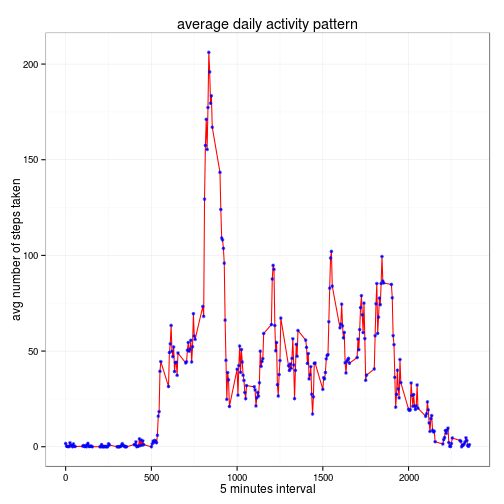
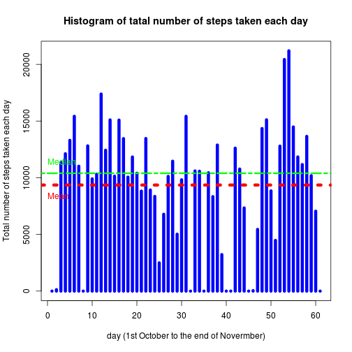
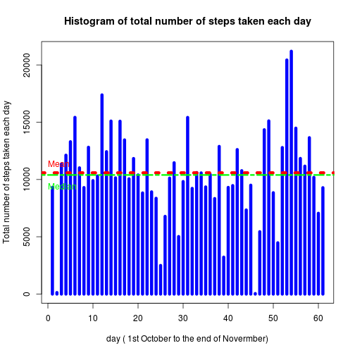
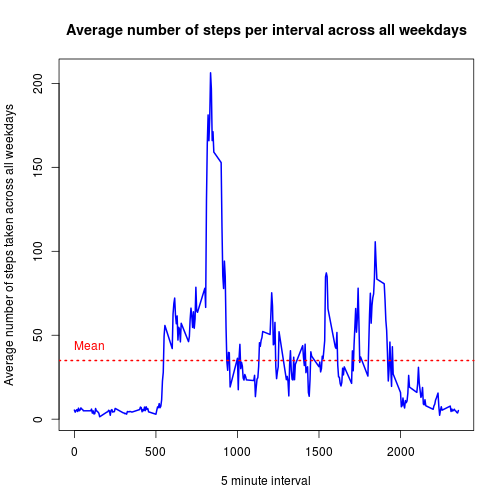
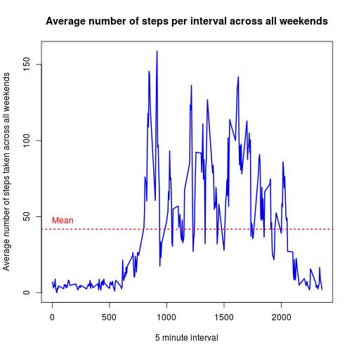

# Assignment 1

## Loading and processing the data:

- setting the working directory.

```r
setwd("~/Documents/Coursera/Reproducible_research/Assignment_1_Dec_015")
getwd()
```

```
## [1] "/home/abu/Documents/Coursera/Reproducible_research/Assignment_1_Dec_015"
```
- check if the data is available in the working directory. If no, unzip the data from its correspoinding zip file.

```r
if (!file.exists("activity.csv")) {
        unzip("repdata-data-activity.zip")
}
```
- Reading the 'activity' data:

```r
activity <- read.csv(file = "activity.csv", sep = ",")
```
- summary and structure of the data:

```r
head(activity,3)
```

```
##   steps       date interval
## 1    NA 2012-10-01        0
## 2    NA 2012-10-01        5
## 3    NA 2012-10-01       10
```

```r
summary(activity)
```

```
##      steps                date          interval     
##  Min.   :  0.00   2012-10-01:  288   Min.   :   0.0  
##  1st Qu.:  0.00   2012-10-02:  288   1st Qu.: 588.8  
##  Median :  0.00   2012-10-03:  288   Median :1177.5  
##  Mean   : 37.38   2012-10-04:  288   Mean   :1177.5  
##  3rd Qu.: 12.00   2012-10-05:  288   3rd Qu.:1766.2  
##  Max.   :806.00   2012-10-06:  288   Max.   :2355.0  
##  NA's   :2304     (Other)   :15840
```

```r
str(activity)
```

```
## 'data.frame':	17568 obs. of  3 variables:
##  $ steps   : int  NA NA NA NA NA NA NA NA NA NA ...
##  $ date    : Factor w/ 61 levels "2012-10-01","2012-10-02",..: 1 1 1 1 1 1 1 1 1 1 ...
##  $ interval: int  0 5 10 15 20 25 30 35 40 45 ...
```
- type of each variable:

```r
lapply(activity,class)
```

```
## $steps
## [1] "integer"
## 
## $date
## [1] "factor"
## 
## $interval
## [1] "integer"
```

## what is mean total number of steps taken per day?
### calculate the total number of steps taken per day.

- Deviding the activity data in the vector 'steps' into the groups defined by date.

```r
step_split <- split(activity$steps, activity$date)
head(step_split)
```

```
## $`2012-10-01`
##   [1] NA NA NA NA NA NA NA NA NA NA NA NA NA NA NA NA NA NA NA NA NA NA NA
##  [24] NA NA NA NA NA NA NA NA NA NA NA NA NA NA NA NA NA NA NA NA NA NA NA
##  [47] NA NA NA NA NA NA NA NA NA NA NA NA NA NA NA NA NA NA NA NA NA NA NA
##  [70] NA NA NA NA NA NA NA NA NA NA NA NA NA NA NA NA NA NA NA NA NA NA NA
##  [93] NA NA NA NA NA NA NA NA NA NA NA NA NA NA NA NA NA NA NA NA NA NA NA
## [116] NA NA NA NA NA NA NA NA NA NA NA NA NA NA NA NA NA NA NA NA NA NA NA
## [139] NA NA NA NA NA NA NA NA NA NA NA NA NA NA NA NA NA NA NA NA NA NA NA
## [162] NA NA NA NA NA NA NA NA NA NA NA NA NA NA NA NA NA NA NA NA NA NA NA
## [185] NA NA NA NA NA NA NA NA NA NA NA NA NA NA NA NA NA NA NA NA NA NA NA
## [208] NA NA NA NA NA NA NA NA NA NA NA NA NA NA NA NA NA NA NA NA NA NA NA
## [231] NA NA NA NA NA NA NA NA NA NA NA NA NA NA NA NA NA NA NA NA NA NA NA
## [254] NA NA NA NA NA NA NA NA NA NA NA NA NA NA NA NA NA NA NA NA NA NA NA
## [277] NA NA NA NA NA NA NA NA NA NA NA NA
## 
## $`2012-10-02`
##   [1]   0   0   0   0   0   0   0   0   0   0   0   0   0   0   0   0   0
##  [18]   0   0   0   0   0   0   0   0   0   0   0   0   0   0   0   0   0
##  [35]   0   0   0   0   0   0   0   0   0   0   0   0   0   0   0   0   0
##  [52]   0   0   0   0   0   0   0   0   0   0   0   0   0   0   0   0   0
##  [69]   0   0   0   0   0   0   0   0   0   0   0   0   0   0   0   0   0
##  [86]   0   0   0   0   0   0   0   0   0   0   0   0   0   0   0   0   0
## [103]   0   0   0   0   0   0   0   0   0   0   0   0   0   0   0   0   0
## [120]   0   0   0   0   0   0   0   0   0   0   0   0   0   0   0   0   0
## [137]   0   0   0   0   0   0   0   0   0   0   0   0   0   0   0   0   0
## [154]   0   0   0   0   0   0   0   0   0   0   0   0   0   0   0   0   0
## [171]   0   0   0   0   0   0   0   0   0   0   0   0   0   0   0   0   0
## [188]   0   0   0   0   0   0   0   0   0   0   0   0   0   0   0   0   0
## [205]   0   0   0   0   0   0   0   0   0   0   0   0   0   0   0   0   0
## [222]   0   0   0   0   0   0   0   0   0   0   0   0   0   0   0   0   0
## [239]   0   0   0   0   0   0   0   0   0   0   0   0   0   0   0   0   0
## [256]   0   0   0   0   0   0   0   0   0   0   0 117   9   0   0   0   0
## [273]   0   0   0   0   0   0   0   0   0   0   0   0   0   0   0   0
## 
## $`2012-10-03`
##   [1]   0   0   0   0   0   0   0   0   0   0   0   0   0   0   0   0   0
##  [18]   0   0   0   0   0   0   0   0   0   0   0   0   0   0   0   0   0
##  [35]   0   0   0   0   0   0   0   0   0   0   0   0   0   0   0   0   4
##  [52]   0   0   0  36   0   0   0   0   0   0   0   0   0   0   0   0  25
##  [69]   0   0  90 411 413 415 519 529 613 562 612 534 323 600 533 251  56
##  [86]   0  32  80  10   9 145  46   0  44 126  42 138  53   0   0  22  57
## [103] 161  19  15   0  16   0   0   8   0  51 516 245   0 161   7   0   0
## [120]   0   0   0   0   0   0   0   0   0   0   0   0   0   0   0   0   0
## [137]   0   0   0  72  73   0   0 116  97   0   0   0   0   0  15   0   0
## [154]   0   0   0  80  69   0   0   0   0   0   0   0  99 100   0   0  33
## [171]   0   0   7   0   0   0   0   0   0   0   0   0   0   0   0   0   0
## [188]   0   0  88 154   0  20   0   0   0   0   0   0   0   0   0   0   0
## [205]   0   0 198  61  75   0   0 193 298   0  15  21   0   0   0   0  51
## [222]  36   0  26  22   0  39  52  15  41   0  42   0   0 159  32   0   0
## [239]   0   0  34   0   0   0   0  36  73   9   0   0   0   0   0   0   0
## [256]   0   0   0  90 128  46   0   0   0   0   0   0   0   0   0   0   0
## [273]   0   0   0   0   0   0   0   0   0   0   0   0   0   8   0   0
## 
## $`2012-10-04`
##   [1]  47   0   0   0   0   0   0   0   0   0   0   0   0   0   0   0   0
##  [18]   0   0   0   0   0   0   0   0   0   0   0   0   0   0   0   0   0
##  [35]   0   0   0   0   0   0   0   0   0   0   0   0   0   0   0   0   0
##  [52]   0   0   0   0   0   0   0   0   0   0   0   7  18  57  40   0   0
##  [69]   0   0  16   1   0  18  20  40  36  17  49  86  49   0  29  59   7
##  [86]  25  30  31   7  18 113 181  87   0   0   0  57  99 507 522 510 519
## [103] 508 423 499 259  31  17   0   0   0   0   0  17   0 145 453 229 144
## [120]   0   0   0  82   0   0   0   0   0   0   0   0   0   0   0   0   0
## [137]   0 180  21   0   0   0   0   0 160  79   0   0   0  46  66 127   0
## [154]   0   0   0   0   0  31   0   0   0   0   0  28 496  78   0   0   0
## [171]   0   0   0   0   0  77  20   7   1 128 354 310   0   0  25  15   0
## [188]   0   0   0  33  33  32  66  77   0  44   0   0   0   0   0   0   0
## [205]   0   0   0   0   0  40   0  37  90  53  73  92 285 527 531 547 175
## [222] 114  62   0  59  65   0 101  43   0   0   0  49  21   0  16  56   0
## [239]   0   0   0   0   0   0   0   0   0   0  17  15   0   0  27 106 122
## [256]  41  35   6   0   0  68   0   0   0   0   0   0   0   0   0   0   0
## [273]   0   0   0   0   0   0   0   0   0   0   0   0   0   0   0   0
## 
## $`2012-10-05`
##   [1]   0   0   0   0   0   0   0   0   0   0   0   0   0   0   0   0   0
##  [18]   0   0   0   0   9  14   0   0   0   0   0   0   7   0   0   0   0
##  [35]  27   0   0   0   0   0   0   0   0   0   0   0   0   0   0  39   0
##  [52]   0   0   0   0   0   0   0   0   0   0  27   0   0   0   0   0   0
##  [69]   0   0   0  52  36   0   0  28  67 119   7  21  29  68  29   0  11
##  [86]  19  84  50   2  43 126  30  19   8 171  68 114   0   9 122 400 451
## [103] 371 470 473 512 449 496 530 509 252  84  16   0   6  46  39   0   0
## [120]   0   0   0   0   0   0   0   0   0   0   0   0   0   0   0   0   0
## [137]   0   0   0   0   0   0   0   0 138 541 555 345 345  10 485 515 168
## [154]   0   0   0   0   0   0   0 349 341   0   0   0   0   0 158 545  82
## [171]   0 105   0   0   0   0   0   0   0   0   0   0   0   0   0   0   0
## [188]   0 326 172 332 402  70   0   0   0   0   0   0   0   0   0   0   0
## [205]   0   0   0  53   0   0   0   0   0   0   7  10  65  40  15  29   0
## [222]  20  35  69  25  46  15  26  33  58  75  59   0   0   0   0   0   0
## [239]   0   0   0   0   0   0   0   0   0  71   0   0   0   0   0   0   0
## [256]   0   0   0   0   0   0   0   0   0   0   0   0   0   0   0   0   0
## [273]   0   0   0   0   0   0   0   0   0   0   0   0   0   0   0   0
## 
## $`2012-10-06`
##   [1]   0   0   0   0   0   0   0   0   0   0   0   0   0   0   0   0   0
##  [18]   0   0   0   0   0   0   0   0   0   0   0   0   0   0   0   0   0
##  [35]   0   0   0   0   0   0   0   0  40  11   0   0   0   0   0   0   0
##  [52]   0   0  19  67   0   0   0   0   0   0   0   0   0   0   0   0   0
##  [69]  27   0   0   0   0   0   0  36  50  38   0   4  42  14   8 135 172
##  [86] 124  31  52   0 104 170  58   0   0  75   0   0 211 321 149   0  82
## [103]  94 225 216 199  50 187  30   0  65 173  43   0   0   0   0   0   0
## [120]   0  16  26   0   0   0   0   0   0   0   0   0   0   0   0   0   0
## [137]   0   0   0  95  64   7  33  72 221 439 519 440 394  97  71  10  87
## [154] 443 500 465 485 351 515 511 506 486 171  12  24  42 140  15   0  43
## [171]  67  48   0   0   9  31  30  64 115  25   0  27   0   0   0   0   0
## [188]   0   0   0   0   0  27  27   0   0   9   0   0  54  35   0  49   0
## [205]   0   0   0  93   0   0  13   0   6  12   0   0  34  77 173 370 402
## [222] 504 485 437 526 264   0  35 124  93   0   0   0   0   0   0   0   0
## [239]   0   0   0   0  33 118   0   6   0 262  33  46  35   0   0   0   0
## [256]   0   0   0   0   0   0   0   0   0   0   0   0   0   0   0   0   0
## [273]   0   0   0   0   0   0   0   0   0   0   0   0   0   0   0   0
```
- calculating the total number of steps taken per day.

```r
Total_steps_per_day <- sapply(step_split, sum, na.rm = T)
Total_steps_per_day
```

```
## 2012-10-01 2012-10-02 2012-10-03 2012-10-04 2012-10-05 2012-10-06 
##          0        126      11352      12116      13294      15420 
## 2012-10-07 2012-10-08 2012-10-09 2012-10-10 2012-10-11 2012-10-12 
##      11015          0      12811       9900      10304      17382 
## 2012-10-13 2012-10-14 2012-10-15 2012-10-16 2012-10-17 2012-10-18 
##      12426      15098      10139      15084      13452      10056 
## 2012-10-19 2012-10-20 2012-10-21 2012-10-22 2012-10-23 2012-10-24 
##      11829      10395       8821      13460       8918       8355 
## 2012-10-25 2012-10-26 2012-10-27 2012-10-28 2012-10-29 2012-10-30 
##       2492       6778      10119      11458       5018       9819 
## 2012-10-31 2012-11-01 2012-11-02 2012-11-03 2012-11-04 2012-11-05 
##      15414          0      10600      10571          0      10439 
## 2012-11-06 2012-11-07 2012-11-08 2012-11-09 2012-11-10 2012-11-11 
##       8334      12883       3219          0          0      12608 
## 2012-11-12 2012-11-13 2012-11-14 2012-11-15 2012-11-16 2012-11-17 
##      10765       7336          0         41       5441      14339 
## 2012-11-18 2012-11-19 2012-11-20 2012-11-21 2012-11-22 2012-11-23 
##      15110       8841       4472      12787      20427      21194 
## 2012-11-24 2012-11-25 2012-11-26 2012-11-27 2012-11-28 2012-11-29 
##      14478      11834      11162      13646      10183       7047 
## 2012-11-30 
##          0
```

### Make a histogram of the total number of steps taken each day.
- the dataset is taken for 61 days. In order to make a better plot, one simply need to convert the date to a numerical value starting from 1 to 61 correspoinding to each date. 


```r
activity$numdate <- as.numeric(activity$date)
unique(activity$numdate)
```

```
##  [1]  1  2  3  4  5  6  7  8  9 10 11 12 13 14 15 16 17 18 19 20 21 22 23
## [24] 24 25 26 27 28 29 30 31 32 33 34 35 36 37 38 39 40 41 42 43 44 45 46
## [47] 47 48 49 50 51 52 53 54 55 56 57 58 59 60 61
```
- plotting

```r
uniqueDates <- unique(activity$numdate)
uniqueDates
```

```
##  [1]  1  2  3  4  5  6  7  8  9 10 11 12 13 14 15 16 17 18 19 20 21 22 23
## [24] 24 25 26 27 28 29 30 31 32 33 34 35 36 37 38 39 40 41 42 43 44 45 46
## [47] 47 48 49 50 51 52 53 54 55 56 57 58 59 60 61
```

```r
plot(uniqueDates, Total_steps_per_day, type = 'h', xlab = 'day', ylab = 'Total number of steps taken each day', main ='Histogram of tatal number of steps taken each day', col='blue', lwd = 6)
```

 

###Calculate and report the mean and median of the total number of steps taken per day.


```r
mean(Total_steps_per_day)
```

```
## [1] 9354.23
```

```r
median(Total_steps_per_day)
```

```
## [1] 10395
```


## What is the average daily activity pattern:

1- Make a time series plot of the 5-minute interval(x-axis) and the average number of steps taken, average across all day (y-axis)


```r
avg<-aggregate(x=list(steps=activity$steps),by=list(interval=activity$interval),FUN=mean,na.rm=T)
head(avg)
```

```
##   interval     steps
## 1        0 1.7169811
## 2        5 0.3396226
## 3       10 0.1320755
## 4       15 0.1509434
## 5       20 0.0754717
## 6       25 2.0943396
```

```r
summary(avg)
```

```
##     interval          steps        
##  Min.   :   0.0   Min.   :  0.000  
##  1st Qu.: 588.8   1st Qu.:  2.486  
##  Median :1177.5   Median : 34.113  
##  Mean   :1177.5   Mean   : 37.383  
##  3rd Qu.:1766.2   3rd Qu.: 52.835  
##  Max.   :2355.0   Max.   :206.170
```

- ploting using ggplot2


```r
library(ggplot2)
g<-ggplot(data=avg,aes(x=interval,y=steps))
g<-g+geom_line(color='red')+theme_bw()
g<-g+xlab('5 minutes interval')+ylab('avg number of steps taken')+ggtitle('average daily activity pattern')
g+geom_point(color='blue',size=1,pch=8)
```

 

- which 5-minute interval, on average across all the days in the dataset contains the maximum number of steps?


```r
avg[which.max(avg$steps),]
```

```
##     interval    steps
## 104      835 206.1698
```

## Imputing missing values:
1. Calculate and report the total number of missing values in the dataset.

```r
NAs <- sum(is.na(activity$steps))
NAs
```

```
## [1] 2304
```

2- Filling in all of the missing values in the dataset. The mean/average of the dataset.  
- For this part, the missing values are filled up with the mean of steps taken for each 5-minute interval.

```r
meanStepsPerDay <- sapply(step_split, mean, na.rm = T)
head(meanStepsPerDay)
```

```
## 2012-10-01 2012-10-02 2012-10-03 2012-10-04 2012-10-05 2012-10-06 
##        NaN    0.43750   39.41667   42.06944   46.15972   53.54167
```

- the Nan values shoule be equal to 0.

```r
meanStepsPerDay[is.na(meanStepsPerDay)] <- 0
head(meanStepsPerDay)
```

```
## 2012-10-01 2012-10-02 2012-10-03 2012-10-04 2012-10-05 2012-10-06 
##    0.00000    0.43750   39.41667   42.06944   46.15972   53.54167
```

- We need to replicate the meanStepsPerDay as many as the number of rows for each specific date. 


```r
table(activity$date)
```

```
## 
## 2012-10-01 2012-10-02 2012-10-03 2012-10-04 2012-10-05 2012-10-06 
##        288        288        288        288        288        288 
## 2012-10-07 2012-10-08 2012-10-09 2012-10-10 2012-10-11 2012-10-12 
##        288        288        288        288        288        288 
## 2012-10-13 2012-10-14 2012-10-15 2012-10-16 2012-10-17 2012-10-18 
##        288        288        288        288        288        288 
## 2012-10-19 2012-10-20 2012-10-21 2012-10-22 2012-10-23 2012-10-24 
##        288        288        288        288        288        288 
## 2012-10-25 2012-10-26 2012-10-27 2012-10-28 2012-10-29 2012-10-30 
##        288        288        288        288        288        288 
## 2012-10-31 2012-11-01 2012-11-02 2012-11-03 2012-11-04 2012-11-05 
##        288        288        288        288        288        288 
## 2012-11-06 2012-11-07 2012-11-08 2012-11-09 2012-11-10 2012-11-11 
##        288        288        288        288        288        288 
## 2012-11-12 2012-11-13 2012-11-14 2012-11-15 2012-11-16 2012-11-17 
##        288        288        288        288        288        288 
## 2012-11-18 2012-11-19 2012-11-20 2012-11-21 2012-11-22 2012-11-23 
##        288        288        288        288        288        288 
## 2012-11-24 2012-11-25 2012-11-26 2012-11-27 2012-11-28 2012-11-29 
##        288        288        288        288        288        288 
## 2012-11-30 
##        288
```

- As shown, There is 288 rows for each date. so:


```r
meanColumn <- rep(meanStepsPerDay, 288)
head(meanColumn)
```

```
## 2012-10-01 2012-10-02 2012-10-03 2012-10-04 2012-10-05 2012-10-06 
##    0.00000    0.43750   39.41667   42.06944   46.15972   53.54167
```

- a new column called steps2 is created. 


```r
activity$steps2 <- activity$steps
head(activity)
```

```
##   steps       date interval numdate steps2
## 1    NA 2012-10-01        0       1     NA
## 2    NA 2012-10-01        5       1     NA
## 3    NA 2012-10-01       10       1     NA
## 4    NA 2012-10-01       15       1     NA
## 5    NA 2012-10-01       20       1     NA
## 6    NA 2012-10-01       25       1     NA
```

- check which rows of the steps2 column is NA. 


```r
steps2_NAs <- is.na(activity$steps2)
head(steps2_NAs)
```

```
## [1] TRUE TRUE TRUE TRUE TRUE TRUE
```

-replacing those NAs values in the steps2 with the mean for that day 


```r
activity$steps2[steps2_NAs] <- meanColumn[steps2_NAs]
head(activity)
```

```
##   steps       date interval numdate   steps2
## 1    NA 2012-10-01        0       1  0.00000
## 2    NA 2012-10-01        5       1  0.43750
## 3    NA 2012-10-01       10       1 39.41667
## 4    NA 2012-10-01       15       1 42.06944
## 5    NA 2012-10-01       20       1 46.15972
## 6    NA 2012-10-01       25       1 53.54167
```

3 - Creating a new datasets that is equal to the original dataset but the the missing data filled in.


```r
newActivity <- read.csv(file = 'activity.csv', sep = ',')
newActivity$steps <- activity$steps2
head(newActivity)
```

```
##      steps       date interval
## 1  0.00000 2012-10-01        0
## 2  0.43750 2012-10-01        5
## 3 39.41667 2012-10-01       10
## 4 42.06944 2012-10-01       15
## 5 46.15972 2012-10-01       20
## 6 53.54167 2012-10-01       25
```

```r
step_split_newActivity <- split(newActivity$steps, newActivity$date)
head(step_split_newActivity)
```

```
## $`2012-10-01`
##   [1]  0.0000000  0.4375000 39.4166667 42.0694444 46.1597222 53.5416667
##   [7] 38.2465278  0.0000000 44.4826389 34.3750000 35.7777778 60.3541667
##  [13] 43.1458333 52.4236111 35.2048611 52.3750000 46.7083333 34.9166667
##  [19] 41.0729167 36.0937500 30.6284722 46.7361111 30.9652778 29.0104167
##  [25]  8.6527778 23.5347222 35.1354167 39.7847222 17.4236111 34.0937500
##  [31] 53.5208333  0.0000000 36.8055556 36.7048611  0.0000000 36.2465278
##  [37] 28.9375000 44.7326389 11.1770833  0.0000000  0.0000000 43.7777778
##  [43] 37.3784722 25.4722222  0.0000000  0.1423611 18.8923611 49.7881944
##  [49] 52.4652778 30.6979167 15.5277778 44.3993056 70.9270833 73.5902778
##  [55] 50.2708333 41.0902778 38.7569444 47.3819444 35.3576389 24.4687500
##  [61]  0.0000000  0.0000000  0.4375000 39.4166667 42.0694444 46.1597222
##  [67] 53.5416667 38.2465278  0.0000000 44.4826389 34.3750000 35.7777778
##  [73] 60.3541667 43.1458333 52.4236111 35.2048611 52.3750000 46.7083333
##  [79] 34.9166667 41.0729167 36.0937500 30.6284722 46.7361111 30.9652778
##  [85] 29.0104167  8.6527778 23.5347222 35.1354167 39.7847222 17.4236111
##  [91] 34.0937500 53.5208333  0.0000000 36.8055556 36.7048611  0.0000000
##  [97] 36.2465278 28.9375000 44.7326389 11.1770833  0.0000000  0.0000000
## [103] 43.7777778 37.3784722 25.4722222  0.0000000  0.1423611 18.8923611
## [109] 49.7881944 52.4652778 30.6979167 15.5277778 44.3993056 70.9270833
## [115] 73.5902778 50.2708333 41.0902778 38.7569444 47.3819444 35.3576389
## [121] 24.4687500  0.0000000  0.0000000  0.4375000 39.4166667 42.0694444
## [127] 46.1597222 53.5416667 38.2465278  0.0000000 44.4826389 34.3750000
## [133] 35.7777778 60.3541667 43.1458333 52.4236111 35.2048611 52.3750000
## [139] 46.7083333 34.9166667 41.0729167 36.0937500 30.6284722 46.7361111
## [145] 30.9652778 29.0104167  8.6527778 23.5347222 35.1354167 39.7847222
## [151] 17.4236111 34.0937500 53.5208333  0.0000000 36.8055556 36.7048611
## [157]  0.0000000 36.2465278 28.9375000 44.7326389 11.1770833  0.0000000
## [163]  0.0000000 43.7777778 37.3784722 25.4722222  0.0000000  0.1423611
## [169] 18.8923611 49.7881944 52.4652778 30.6979167 15.5277778 44.3993056
## [175] 70.9270833 73.5902778 50.2708333 41.0902778 38.7569444 47.3819444
## [181] 35.3576389 24.4687500  0.0000000  0.0000000  0.4375000 39.4166667
## [187] 42.0694444 46.1597222 53.5416667 38.2465278  0.0000000 44.4826389
## [193] 34.3750000 35.7777778 60.3541667 43.1458333 52.4236111 35.2048611
## [199] 52.3750000 46.7083333 34.9166667 41.0729167 36.0937500 30.6284722
## [205] 46.7361111 30.9652778 29.0104167  8.6527778 23.5347222 35.1354167
## [211] 39.7847222 17.4236111 34.0937500 53.5208333  0.0000000 36.8055556
## [217] 36.7048611  0.0000000 36.2465278 28.9375000 44.7326389 11.1770833
## [223]  0.0000000  0.0000000 43.7777778 37.3784722 25.4722222  0.0000000
## [229]  0.1423611 18.8923611 49.7881944 52.4652778 30.6979167 15.5277778
## [235] 44.3993056 70.9270833 73.5902778 50.2708333 41.0902778 38.7569444
## [241] 47.3819444 35.3576389 24.4687500  0.0000000  0.0000000  0.4375000
## [247] 39.4166667 42.0694444 46.1597222 53.5416667 38.2465278  0.0000000
## [253] 44.4826389 34.3750000 35.7777778 60.3541667 43.1458333 52.4236111
## [259] 35.2048611 52.3750000 46.7083333 34.9166667 41.0729167 36.0937500
## [265] 30.6284722 46.7361111 30.9652778 29.0104167  8.6527778 23.5347222
## [271] 35.1354167 39.7847222 17.4236111 34.0937500 53.5208333  0.0000000
## [277] 36.8055556 36.7048611  0.0000000 36.2465278 28.9375000 44.7326389
## [283] 11.1770833  0.0000000  0.0000000 43.7777778 37.3784722 25.4722222
## 
## $`2012-10-02`
##   [1]   0   0   0   0   0   0   0   0   0   0   0   0   0   0   0   0   0
##  [18]   0   0   0   0   0   0   0   0   0   0   0   0   0   0   0   0   0
##  [35]   0   0   0   0   0   0   0   0   0   0   0   0   0   0   0   0   0
##  [52]   0   0   0   0   0   0   0   0   0   0   0   0   0   0   0   0   0
##  [69]   0   0   0   0   0   0   0   0   0   0   0   0   0   0   0   0   0
##  [86]   0   0   0   0   0   0   0   0   0   0   0   0   0   0   0   0   0
## [103]   0   0   0   0   0   0   0   0   0   0   0   0   0   0   0   0   0
## [120]   0   0   0   0   0   0   0   0   0   0   0   0   0   0   0   0   0
## [137]   0   0   0   0   0   0   0   0   0   0   0   0   0   0   0   0   0
## [154]   0   0   0   0   0   0   0   0   0   0   0   0   0   0   0   0   0
## [171]   0   0   0   0   0   0   0   0   0   0   0   0   0   0   0   0   0
## [188]   0   0   0   0   0   0   0   0   0   0   0   0   0   0   0   0   0
## [205]   0   0   0   0   0   0   0   0   0   0   0   0   0   0   0   0   0
## [222]   0   0   0   0   0   0   0   0   0   0   0   0   0   0   0   0   0
## [239]   0   0   0   0   0   0   0   0   0   0   0   0   0   0   0   0   0
## [256]   0   0   0   0   0   0   0   0   0   0   0 117   9   0   0   0   0
## [273]   0   0   0   0   0   0   0   0   0   0   0   0   0   0   0   0
## 
## $`2012-10-03`
##   [1]   0   0   0   0   0   0   0   0   0   0   0   0   0   0   0   0   0
##  [18]   0   0   0   0   0   0   0   0   0   0   0   0   0   0   0   0   0
##  [35]   0   0   0   0   0   0   0   0   0   0   0   0   0   0   0   0   4
##  [52]   0   0   0  36   0   0   0   0   0   0   0   0   0   0   0   0  25
##  [69]   0   0  90 411 413 415 519 529 613 562 612 534 323 600 533 251  56
##  [86]   0  32  80  10   9 145  46   0  44 126  42 138  53   0   0  22  57
## [103] 161  19  15   0  16   0   0   8   0  51 516 245   0 161   7   0   0
## [120]   0   0   0   0   0   0   0   0   0   0   0   0   0   0   0   0   0
## [137]   0   0   0  72  73   0   0 116  97   0   0   0   0   0  15   0   0
## [154]   0   0   0  80  69   0   0   0   0   0   0   0  99 100   0   0  33
## [171]   0   0   7   0   0   0   0   0   0   0   0   0   0   0   0   0   0
## [188]   0   0  88 154   0  20   0   0   0   0   0   0   0   0   0   0   0
## [205]   0   0 198  61  75   0   0 193 298   0  15  21   0   0   0   0  51
## [222]  36   0  26  22   0  39  52  15  41   0  42   0   0 159  32   0   0
## [239]   0   0  34   0   0   0   0  36  73   9   0   0   0   0   0   0   0
## [256]   0   0   0  90 128  46   0   0   0   0   0   0   0   0   0   0   0
## [273]   0   0   0   0   0   0   0   0   0   0   0   0   0   8   0   0
## 
## $`2012-10-04`
##   [1]  47   0   0   0   0   0   0   0   0   0   0   0   0   0   0   0   0
##  [18]   0   0   0   0   0   0   0   0   0   0   0   0   0   0   0   0   0
##  [35]   0   0   0   0   0   0   0   0   0   0   0   0   0   0   0   0   0
##  [52]   0   0   0   0   0   0   0   0   0   0   0   7  18  57  40   0   0
##  [69]   0   0  16   1   0  18  20  40  36  17  49  86  49   0  29  59   7
##  [86]  25  30  31   7  18 113 181  87   0   0   0  57  99 507 522 510 519
## [103] 508 423 499 259  31  17   0   0   0   0   0  17   0 145 453 229 144
## [120]   0   0   0  82   0   0   0   0   0   0   0   0   0   0   0   0   0
## [137]   0 180  21   0   0   0   0   0 160  79   0   0   0  46  66 127   0
## [154]   0   0   0   0   0  31   0   0   0   0   0  28 496  78   0   0   0
## [171]   0   0   0   0   0  77  20   7   1 128 354 310   0   0  25  15   0
## [188]   0   0   0  33  33  32  66  77   0  44   0   0   0   0   0   0   0
## [205]   0   0   0   0   0  40   0  37  90  53  73  92 285 527 531 547 175
## [222] 114  62   0  59  65   0 101  43   0   0   0  49  21   0  16  56   0
## [239]   0   0   0   0   0   0   0   0   0   0  17  15   0   0  27 106 122
## [256]  41  35   6   0   0  68   0   0   0   0   0   0   0   0   0   0   0
## [273]   0   0   0   0   0   0   0   0   0   0   0   0   0   0   0   0
## 
## $`2012-10-05`
##   [1]   0   0   0   0   0   0   0   0   0   0   0   0   0   0   0   0   0
##  [18]   0   0   0   0   9  14   0   0   0   0   0   0   7   0   0   0   0
##  [35]  27   0   0   0   0   0   0   0   0   0   0   0   0   0   0  39   0
##  [52]   0   0   0   0   0   0   0   0   0   0  27   0   0   0   0   0   0
##  [69]   0   0   0  52  36   0   0  28  67 119   7  21  29  68  29   0  11
##  [86]  19  84  50   2  43 126  30  19   8 171  68 114   0   9 122 400 451
## [103] 371 470 473 512 449 496 530 509 252  84  16   0   6  46  39   0   0
## [120]   0   0   0   0   0   0   0   0   0   0   0   0   0   0   0   0   0
## [137]   0   0   0   0   0   0   0   0 138 541 555 345 345  10 485 515 168
## [154]   0   0   0   0   0   0   0 349 341   0   0   0   0   0 158 545  82
## [171]   0 105   0   0   0   0   0   0   0   0   0   0   0   0   0   0   0
## [188]   0 326 172 332 402  70   0   0   0   0   0   0   0   0   0   0   0
## [205]   0   0   0  53   0   0   0   0   0   0   7  10  65  40  15  29   0
## [222]  20  35  69  25  46  15  26  33  58  75  59   0   0   0   0   0   0
## [239]   0   0   0   0   0   0   0   0   0  71   0   0   0   0   0   0   0
## [256]   0   0   0   0   0   0   0   0   0   0   0   0   0   0   0   0   0
## [273]   0   0   0   0   0   0   0   0   0   0   0   0   0   0   0   0
## 
## $`2012-10-06`
##   [1]   0   0   0   0   0   0   0   0   0   0   0   0   0   0   0   0   0
##  [18]   0   0   0   0   0   0   0   0   0   0   0   0   0   0   0   0   0
##  [35]   0   0   0   0   0   0   0   0  40  11   0   0   0   0   0   0   0
##  [52]   0   0  19  67   0   0   0   0   0   0   0   0   0   0   0   0   0
##  [69]  27   0   0   0   0   0   0  36  50  38   0   4  42  14   8 135 172
##  [86] 124  31  52   0 104 170  58   0   0  75   0   0 211 321 149   0  82
## [103]  94 225 216 199  50 187  30   0  65 173  43   0   0   0   0   0   0
## [120]   0  16  26   0   0   0   0   0   0   0   0   0   0   0   0   0   0
## [137]   0   0   0  95  64   7  33  72 221 439 519 440 394  97  71  10  87
## [154] 443 500 465 485 351 515 511 506 486 171  12  24  42 140  15   0  43
## [171]  67  48   0   0   9  31  30  64 115  25   0  27   0   0   0   0   0
## [188]   0   0   0   0   0  27  27   0   0   9   0   0  54  35   0  49   0
## [205]   0   0   0  93   0   0  13   0   6  12   0   0  34  77 173 370 402
## [222] 504 485 437 526 264   0  35 124  93   0   0   0   0   0   0   0   0
## [239]   0   0   0   0  33 118   0   6   0 262  33  46  35   0   0   0   0
## [256]   0   0   0   0   0   0   0   0   0   0   0   0   0   0   0   0   0
## [273]   0   0   0   0   0   0   0   0   0   0   0   0   0   0   0   0
```

```r
Total_steps_per_day_newActivity <- sapply(step_split_newActivity, sum)
head(Total_steps_per_day_newActivity)
```

```
## 2012-10-01 2012-10-02 2012-10-03 2012-10-04 2012-10-05 2012-10-06 
##   9312.632    126.000  11352.000  12116.000  13294.000  15420.000
```

4 - Make a histogram of the total number of steps taken each day and Calculate and report the mean and median total number of steps taken per day. Do these values differ from the estimates from the first part of the assignment? What is the impact of imputing missing data on the estimates of the total daily number of steps?
- for comparison, two figures are plotted here. The first one is from the original datasets and the second one is the NA's filled up edition.  


```r
mean(Total_steps_per_day)
```

```
## [1] 9354.23
```

```r
median(Total_steps_per_day)
```

```
## [1] 10395
```


```r
plot(uniqueDates, Total_steps_per_day, type = 'h', xlab = 'day (1st October to the end of Novermber)', ylab = 'Total number of steps taken each day', main ='Histogram of tatal number of steps taken each day', col='blue', lwd = 6)
abline(h=mean(Total_steps_per_day), lty=3, col= 'red', lwd = 6)
text(0,8000, "Mean", col = "red", adj = c(0, -.2), lwd =20)
abline(h=median(Total_steps_per_day), lty = 6, col =  'green', lwd = 3)
text(0,11000, "Median", col = "green", adj = c(0, -.2), lwd =20)
```

 
 
And the second plot is.


```r
mean(Total_steps_per_day_newActivity)
```

```
## [1] 10579.21
```

```r
median(Total_steps_per_day_newActivity)
```

```
## [1] 10395
```


```r
plot(uniqueDates,Total_steps_per_day_newActivity, type = 'h', xlab = 'day ( 1st October to the end of Novermber)', ylab = 'Total number of steps taken each day', main = 'Histogram of total number of steps taken each day', col='blue', lwd= 6 )
abline(h=mean(Total_steps_per_day_newActivity), lty=3, col= 'red', lwd = 6)
text(0,11000, "Mean", col = "red", adj = c(0, -.2), lwd =20)
abline(h=median(Total_steps_per_day_newActivity), lty = 6, col =  'green', lwd = 3)
text(0,9000, "Median", col = "green", adj = c(0, -.2), lwd =20)
```

 

- As we can see, when the missing values are filled up with the mean values of the 5-minute interval avargaed over all days, the mean value is shiffted upward. It is worth noting that the the value of the medaian is not changed. 


### Are there differences in activity patterns between weekdays and weekends?

1- Create a new factor variable in the dataset with two levels – “weekday” and “weekend” indicating whether a given date is a weekday or weekend day.


```r
dates <- strptime(activity$date, "%Y-%m-%d")
w_days <- dates$wday
unique(w_days)
```

```
## [1] 1 2 3 4 5 6 0
```

w_days is from 0 to 6. 0 represents Sunday, 1 is Monday and so on.


```r
type_w_days <- rep(0, length(w_days)-1)
unique(type_w_days)
```

```
## [1] 0
```

- setting the weekdays equal to 1 and weekends equal to 2.

```r
type_w_days[w_days >= 1 & w_days <= 5] <- 1
type_w_days[w_days == 6 | w_days == 0] <- 2
```


```r
days_Factor <- factor(type_w_days, levels = c(1,2), labels = c('Weekdays', 'Weekends'))

newActivity$type_day <- days_Factor
head(newActivity,3)
```

```
##      steps       date interval type_day
## 1  0.00000 2012-10-01        0 Weekdays
## 2  0.43750 2012-10-01        5 Weekdays
## 3 39.41667 2012-10-01       10 Weekdays
```

```r
class(newActivity$type_day)
```

```
## [1] "factor"
```

- splitting to the two data frames.

```r
weekdays <- newActivity[newActivity$type_day == 'Weekdays', ]
weekends <- newActivity[newActivity$type_day == 'Weekends', ]
head(weekdays)
```

```
##      steps       date interval type_day
## 1  0.00000 2012-10-01        0 Weekdays
## 2  0.43750 2012-10-01        5 Weekdays
## 3 39.41667 2012-10-01       10 Weekdays
## 4 42.06944 2012-10-01       15 Weekdays
## 5 46.15972 2012-10-01       20 Weekdays
## 6 53.54167 2012-10-01       25 Weekdays
```

```r
head(weekends)
```

```
##      steps       date interval type_day
## 1441     0 2012-10-06        0 Weekends
## 1442     0 2012-10-06        5 Weekends
## 1443     0 2012-10-06       10 Weekends
## 1444     0 2012-10-06       15 Weekends
## 1445     0 2012-10-06       20 Weekends
## 1446     0 2012-10-06       25 Weekends
```

2- Make a panel plot containing a time series plot (i.e. type = "l") of the 5-minute interval (x-axis) and the average number of steps taken, averaged across all weekday days or weekend days (y-axis). See the README file in the GitHub repository to see an example of what this plot should look like using simulated data.

- Splitting weekdays and weekend by their intervals


```r
split_weekdays <- split(weekdays$steps, weekdays$interval)
split_weekends <- split(weekends$steps, weekends$interval)
```

- Average for each 5-minute interval


```r
avg_steps_weekdays_interval <- sapply(split_weekdays, mean)
avg_steps_weekends_interval <- sapply(split_weekends, mean)
head(avg_steps_weekdays_interval)
```

```
##        0        5       10       15       20       25 
## 5.412809 4.176620 5.117130 5.673302 4.575000 6.571682
```

```r
head(avg_steps_weekends_interval)
```

```
##        0        5       10       15       20       25 
## 6.733290 6.893446 3.141927 4.833550 4.230903 9.007161
```

- plotting for weekdays.


```r
#par(mfcol=c(2,1))
unique_intervals <- unique(activity$interval)
plot(unique_intervals,avg_steps_weekdays_interval, type="l",
main="Average number of steps per interval across all weekdays", 
xlab="5 minute interval", ylab="Average number of steps taken across all weekdays", 
lwd=2, col="blue")
abline(h=mean(avg_steps_weekdays_interval), lty = 3, lwd = 2, col= 'red')
text(0,40, "Mean", col = "red", adj = c(0, -.2), lwd =20)
```

 

- plotting for weekends.


```r
plot(unique_intervals, avg_steps_weekends_interval, type="l",
main="Average number of steps per interval across all weekends", 
xlab="5 minute interval", ylab="Average number of steps taken across all weekends", lwd=2, col="blue")
abline(h=mean(avg_steps_weekends_interval), lty = 3, lwd = 2, col= 'red')
text(0,45, "Mean", col = "red", adj = c(0, -.2), lwd =20)
```

 

